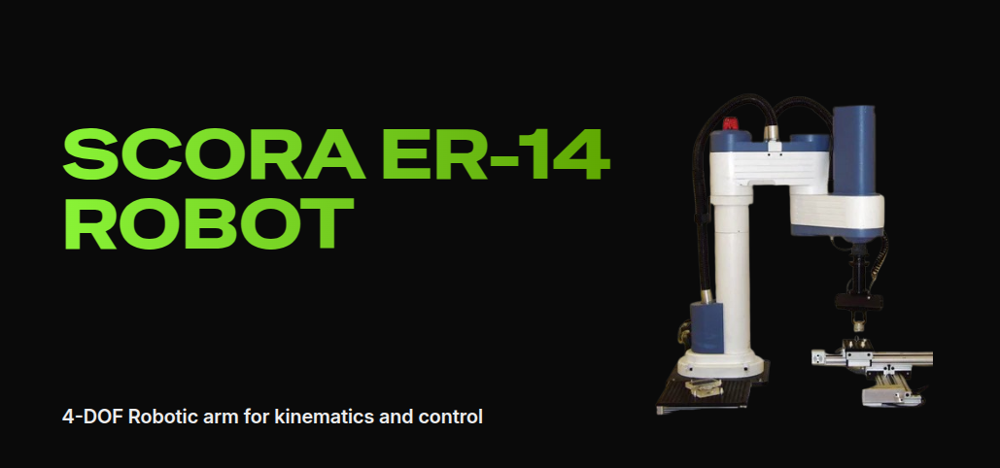

This is web-based user interface for operating SCORA ER-14 which is a 4-degree-of-freedom (DOF) robotic arm designed for educational and industrial applications. It features a robust mechanical structure with precise joint articulation, enabling users to perform forward and inverse kinematics calculations for motion planning. The robot is commonly used in real-world automation techniques.

> Mady by high-house
